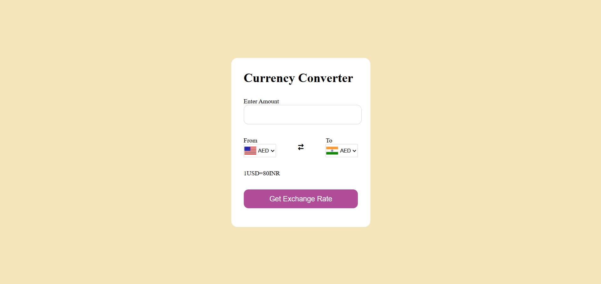

### 🏦 Currency Converter

A simple and interactive Currency Converter built using HTML, CSS, and JavaScript. It allows users to convert an amount from one currency to another.

---

### 📷 Screenshot

### Output

---

### 🚀 Features

🔄 Convert between any two currencies

💡 Simple and clean UI

⚡ Fast and responsive

---

### 📁 Project Structure
/currency-converter
│── code.js
│── index.html
│── style.css
│── script.js
│── README.md

---

### 🛠️ Technologies Used

HTML5 – structure

CSS3 – styling

JavaScript (ES6) – main logic

### ⚙️ How It Works

User selects From Currency and To Currency

Enters the amount

Converted amount is displayed instantly

### 🔧 Setup & Usage
1. Clone this repository
git clone https://github.com/amanchougule09/Currency-Converter-using-JS.git

2. Open the project

Just open the index.html file in any browser.

---

